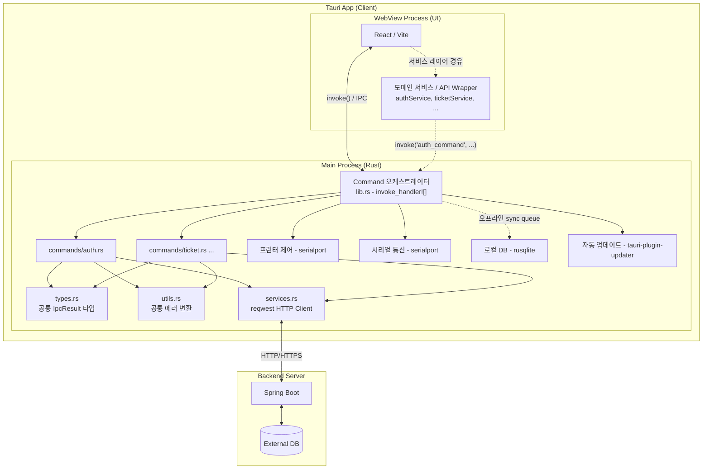
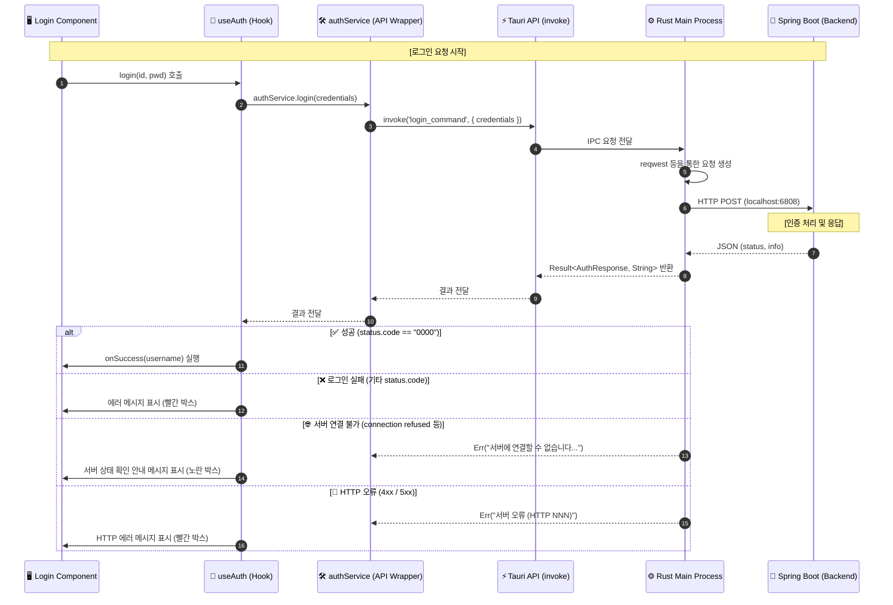

# Tauri POS Project

## 🛠 기술 스택 및 라이브러리

| 구분 | 기술 |
| :--- | :--- |
| **Language** | [TypeScript](https://www.typescriptlang.org/) (Frontend), [Rust](https://www.rust-lang.org/) (Backend) |
| **Frontend Framework** | [React 19](https://react.dev/) |
| **Desktop Framework** | [Tauri v2](https://tauri.app/) |
| **Build Tool** | [Vite 7](https://vitejs.dev/) |
| **Package Manager** | [pnpm](https://pnpm.io/) |
| **HTTP Client (Rust)** | [reqwest 0.12](https://docs.rs/reqwest) |
| **Serialization (Rust)** | [serde / serde_json 1](https://serde.rs/) |

---

## 💻 1. 개발 환경 세팅 (Setup)

### 1.1 OS별 필수 도구 설치
#### Windows
1. **Visual Studio Community** 설치 ("C++를 사용한 데스크톱 개발" 워크로드 필수)
2. **Rust 설치**: [rustup.rs](https://rustup.rs/)에서 설치 (MSVC 툴체인 사용)
3. **Node.js & pnpm 설치**

#### macOS
1. **Xcode Command Line Tools**: `xcode-select --install`
2. **Rust 설치**: `curl --proto '=https' --tlsv1.2 -sSf https://sh.rustup.rs | sh`
3. **Node.js & pnpm 설치**

### 1.2 IDE 세팅 (VS Code / Cursor)
**필수 확장:**
- `rust-analyzer`: Rust 자동완성 및 오류 표시
- `Tauri`: 공식 확장 (명령어 실행 및 설정 파일 유효성 검사)

**권장 설정 (`settings.json`):**
```json
{
  "rust-analyzer.checkOnSave.command": "clippy",
  "rust-analyzer.cargo.features": "all"
}
```

### 1.3 의존성 설치 및 실행
```bash
# 의존성 설치
pnpm install

# 개발 모드 실행 (Hot Reload 지원)
pnpm tauri dev
```

---

## 📂 2. 프로젝트 구조 (Structure)

Tauri의 보안 및 성능 모범 사례에 따라 프론트엔드와 네이티브 계층이 분리된 아키텍처를 가집니다.

```text
study_tauri/
├── src/                             # WebView 프로세스 (React UI 환경)
│   ├── api/                         # Tauri Command 호출 래퍼 서비스
│   │   └── authService.ts           # Auth 도메인 서비스 (login 등)
│   ├── components/                  # React 컴포넌트 및 스타일
│   │   ├── Login.tsx                # 로그인 화면
│   │   ├── MainMenu.tsx             # 메인 메뉴
│   │   ├── TicketSales.tsx          # 티켓 판매 화면
│   │   └── DeviceManagement.tsx     # 기기 관리 화면
│   ├── hooks/                       # Custom Hooks (비즈니스 로직 분리)
│   │   └── useAuth.ts               # 인증 상태 관리 훅
│   ├── types/                       # TypeScript 타입 정의
│   │   ├── auth.ts                  # Auth 관련 요청/응답 타입
│   │   └── ipc.ts                   # Command 공통 응답 타입 (IpcResponse<T>)
│   ├── App.tsx                      # 메인 앱 컴포넌트 및 라우팅 로직
│   └── main.tsx                     # React 진입점 (DOM 렌더링)
├── src-tauri/                       # 메인 프로세스 (Rust 네이티브 환경)
│   ├── .cargo/
│   │   └── config.toml              # 빌드 환경변수 (API_BASE_URL_DEV/PROD, POS_DEVICE_ID)
│   ├── src/                         # Rust 소스 코드
│   │   ├── commands/                # UI에서 호출하는 Rust Command 함수 (확장 포인트)
│   │   │   ├── mod.rs               # commands 모듈 선언
│   │   │   └── auth.rs              # Auth 도메인 Commands (auth_login 등)
│   │   ├── config.rs                # 빌드 환경변수 상수 (BASE_URL, LOGIN_PATH, DEVICE_ID)
│   │   ├── services.rs              # 백엔드 통신용 HTTP 클라이언트 (reqwest + 토큰 관리)
│   │   ├── types.rs                 # 공통 IPC 응답 타입 (IpcResult) — 모든 Command에서 재사용
│   │   ├── utils.rs                 # reqwest 에러 → 한국어 메시지 변환 공통 유틸
│   │   ├── lib.rs                   # 모든 Command를 등록하는 진입점 (오케스트레이터)
│   │   └── main.rs                  # 앱 생명주기 (lib.rs의 run() 호출)
│   ├── capabilities/
│   │   └── default.json             # Tauri 권한 및 허용 Command 설정
│   ├── Cargo.toml                   # Rust 의존성 관리
│   └── tauri.conf.json              # Tauri 앱 설정 (윈도우, 번들, 빌드, CSP 등)
├── index.html                       # 메인 HTML 템플릿
├── package.json                     # Node.js 의존성 및 스크립트
├── vite.config.ts                   # Vite 빌드 설정
└── tsconfig.json                    # TypeScript 설정
```

> **Electron과의 구조 비교**:
> | 역할 | Electron | Tauri |
> | :--- | :--- | :--- |
> | IPC 핸들러 등록 | `src/main/api/ipcHandlers.ts` | `src-tauri/src/lib.rs` |
> | 도메인 핸들러 | `src/main/api/handlers/authHandlers.ts` | `src-tauri/src/commands/auth.rs` |
> | 공통 응답 타입 | `src/main/api/ipcErrorHandler.ts` (IpcResult) | `src-tauri/src/types.rs` (IpcResult) |
> | HTTP 클라이언트 | `src/main/api/axiosInstance.ts` (Axios) | `src-tauri/src/services.rs` (reqwest) |
> | 에러 변환 유틸 | `src/main/api/utils/ipcErrorHandler.ts` | `src-tauri/src/utils.rs` |
> | 보안 브릿지 | `src/preload/preload.ts` (contextBridge) | **없음** (Tauri 내장 보안 모델) |
> | 전역 타입 선언 | `src/renderer/types/electron.d.ts` | **없음** (`invoke<T>()` 제네릭으로 대체) |

---

## 🏗️ 3. 전체 아키텍처 및 연동 구조 (Architecture)

현재 프로젝트는 **Tauri(Frontend/Client)**와 **Spring Boot(Backend/Server)**가 연동되는 구조로, 보안과 성능을 고려하여 역할이 분담되어 있습니다.



### 3.1 계층별 상세 역할

#### 1) WebView Process (UI)
- **Framework**: React / Vite 기반 웹 UI
- **역할**: 사용자 접점(UI/UX), 데이터 입력 및 결과 표시
- **통신**: 보안을 위해 직접적인 외부 API 호출 대신 `invoke()`를 통해 Rust Main Process에 요청을 위임합니다.

#### 2) Main Process (Rust)
- **역할**: 앱의 생명주기 관리 및 하드웨어/시스템 자원 제어 (강력한 보안 및 성능)
- **핵심 기능**:
    - **프린터 제어**: 영수증 출력 등 (`serialport` 등 Rust 크레이트 활용)
    - **시리얼 통신**: POS 주변기기(카드 단말기 등) 연결
    - **로컬 DB**: 오프라인 모드 지원 및 캐싱 (`rusqlite` 등)
    - **오프라인 Sync**: 네트워크 단절 시 데이터를 로컬에 큐잉 후 자동 동기화
    - **자동 업데이트**: Tauri 기본 플러그인을 통한 최신 버전 유지

#### 3) Spring Boot (Backend)
- **역할**: 중앙 집중식 데이터 관리 및 비즈니스 로직 처리
- **핵심 기능**:
    - **메뉴/재고 관리**: 마스터 데이터 관리
    - **매출/현황**: 전체 포스 데이터 집계
    - **멀티 포스 동기화**: 여러 단말기 간 데이터 정합성 유지

---

## 🔄 4. API 통신 프로세스 및 로직 (Process Logic)

보안을 위해 **IPC (Inter-Process Communication)** 방식을 사용합니다. 렌더러는 직접 통신하지 않고 Rust 메인 프로세스를 거쳐 백엔드와 통신합니다.

### 4.1 데이터 흐름도 (Data Flow)



### 4.2 계층별 핵심 역할 (Layer Responsibilities)

| 계층 (Layer) | 파일 위치 | 주요 역할 |
| :--- | :--- | :--- |
| **Component** | `src/components/` | **[사용자 접점]** UI 렌더링, 사용자 입력 수집 |
| **Hook** | `src/hooks/` | **[상태 관리]** UI 상태(로딩, 에러) 제어 및 비즈니스 로직 |
| **Service (Renderer)** | `src/api/` | **[IPC 래퍼]** Tauri `invoke`를 호출하기 쉬운 함수로 래핑 |
| **Types** | `src/types/ipc.ts` | **[공통 타입]** `IpcResponse<T>` – 모든 Command 응답의 공통 인터페이스 |
| **Command Handler** | `src-tauri/src/commands/` | **[도메인 로직]** `#[tauri::command]` 함수 (파일 1개 = 도메인 1개) |
| **Common Types (Rust)** | `src-tauri/src/types.rs` | **[공통 응답 타입]** `IpcResult` – 모든 Command 반환 타입 |
| **Error Util** | `src-tauri/src/utils.rs` | **[공통 에러 변환]** reqwest 에러 → 한국어 메시지 일관된 변환 |
| **HTTP Client** | `src-tauri/src/services.rs` | **[HTTP 클라이언트]** 백엔드 통신 + 인증 토큰 관리 (`reqwest`) |
| **Main (Rust)** | `src-tauri/src/lib.rs` | **[진입점]** 모든 Command를 한 곳에서 등록하는 오케스트레이터 |

### 4.3 새 도메인 API 추가 가이드 (Extensibility)

새 도메인(예: `ticket`, `device`, `open`)의 API를 추가할 때 아래 4단계를 따릅니다.

> **Electron vs Tauri 차이점**: Electron은 Main/Preload/Renderer 3계층 구조(ipcMain → contextBridge → ipcRenderer)이지만, Tauri는 Preload 계층 없이 `invoke()` 호출로 Rust Command에 직접 접근합니다.

#### Step 1 — Rust Command 생성
`src-tauri/src/commands/ticket.rs` 파일을 생성하고 Command 함수를 구현합니다.
Electron의 `ipcMain.handle()` 역할을 합니다.

```rust
// src-tauri/src/commands/ticket.rs
use serde::{Deserialize, Serialize};

#[derive(Serialize, Deserialize)]
pub struct TicketSale {
    pub id: u32,
    pub amount: u64,
}

#[tauri::command]
pub async fn get_sale_list(page: u32, size: u32) -> Result<Vec<TicketSale>, String> {
    // reqwest를 사용한 백엔드 HTTP 호출
    let client = reqwest::Client::new();
    let response = client
        .get("http://localhost:6808/api/air/ticket/sales")
        .query(&[("page", page), ("size", size)])
        .send()
        .await
        .map_err(|e| format!("서버에 연결할 수 없습니다: {}", e))?;

    if !response.status().is_success() {
        return Err(format!("서버 오류 (HTTP {})", response.status().as_u16()));
    }

    response
        .json::<Vec<TicketSale>>()
        .await
        .map_err(|e| format!("서버 응답 형식이 올바르지 않습니다: {}", e))
}
```

#### Step 2 — `main.rs` 오케스트레이터에 등록
`src-tauri/src/main.rs` (또는 `lib.rs`)에 Command를 등록합니다.
Electron의 `ipcHandlers.ts`에서 핸들러를 등록하는 것과 동일한 역할입니다.

```rust
// src-tauri/src/lib.rs
mod commands;
mod services;
mod utils;

use services::http::HttpClient;

#[cfg_attr(mobile, tauri::mobile_entry_point)]
pub fn run() {
    tauri::Builder::default()
        .manage(HttpClient::new())
        .plugin(tauri_plugin_opener::init())
        .invoke_handler(tauri::generate_handler![
            commands::auth::auth_login,
            commands::ticket::get_sale_list, // ← 추가
        ])
        .run(tauri::generate_context!())
        .expect("error while running tauri application");
}
```

> **참고**: Electron의 Preload(`contextBridge.exposeInMainWorld()`)와 타입 선언(`electron.d.ts`)에 해당하는 단계는 Tauri에서 불필요합니다. Tauri는 보안 모델이 내장되어 있어 `invoke()`가 직접 Command를 호출합니다.

#### Step 3 — 전역 타입 선언 추가 (TypeScript)
`src/types/tauri.d.ts` 또는 해당 도메인 타입 파일에 요청/응답 타입을 추가합니다.

```typescript
// src/types/ticket.ts
export interface TicketSale {
  id: number;
  amount: number;
}

export interface TicketSaleParams {
  page: number;
  size: number;
}
```

#### Step 4 — Renderer 서비스 파일 생성
`src/api/ticketService.ts` 파일을 생성합니다.
Electron의 preload 브릿지(`window.electron.ticket.*`) 대신 Tauri의 `invoke()`를 직접 사용합니다.

```typescript
// src/api/ticketService.ts
import { invoke } from '@tauri-apps/api/core';
import { TicketSale, TicketSaleParams } from '../types/ticket';

export const ticketService = {
  getSaleList: async (params: TicketSaleParams): Promise<TicketSale[]> => {
    // Electron: window.electron.ticket.getSaleList(params)
    // Tauri:    invoke('get_sale_list', { page, size })
    return await invoke<TicketSale[]>('get_sale_list', {
      page: params.page,
      size: params.size,
    });
    // 실패 시 Rust에서 Err(String)을 반환하면 여기서 throw됩니다.
  },
};
```

### 4.4 에러 처리 전략 (Error Handling)

Rust Command는 `Result<T, String>` 타입을 반환하며, `Err(String)`을 반환하면 JavaScript 측에서 `invoke()`가 `throw`합니다. 모든 도메인 핸들러가 일관된 에러 메시지 포맷을 사용하도록 Rust 유틸 함수로 공통 처리합니다.

> **Electron 비교**: Electron의 `handleAxiosError()` 유틸 함수 역할을 Rust의 공통 에러 변환 함수 또는 `map_err()`가 대체합니다.

| 오류 유형 | 조건 | 사용자 메시지 | UI 표시 |
| :--- | :--- | :--- | :--- |
| **서버 연결 불가** | reqwest `connection refused`, `timeout` 등 | "서버에 연결할 수 없습니다. 서버 상태를 확인해주세요." | 노란 경고 박스 (⚠) |
| **HTTP 오류** | 4xx / 5xx 응답 | "서버 오류가 발생했습니다. (HTTP NNN)" | 빨간 에러 박스 |
| **로그인 실패** | `info` 필드 비어있음 또는 인증 거부 | "로그인 정보가 올바르지 않습니다." | 빨간 에러 박스 |
| **비정상 응답 코드** | `status.code != "0000"` | 서버 메시지 또는 "로그인 실패 (코드: NNN)" | 빨간 에러 박스 |
| **응답 구조 불일치** | JSON 역직렬화 실패 | "서버 응답 형식이 올바르지 않습니다." | 빨간 에러 박스 |

---

## 🐛 5. 로그인 에러 처리 (Login Error Handling)

### 5.1 로그인 실패 메시지 처리 흐름

로그인 실패 시 에러 메시지가 UI에 정상적으로 표시되도록 개선되었습니다.

#### 에러 처리 계층

| 계층 | 파일 | 역할 |
| :--- | :--- | :--- |
| **Rust Backend** | `src-tauri/src/commands/auth.rs` | HTTP 요청 실패 또는 비즈니스 로직 검증 실패 시 `IpcResult::err(message)`로 반환 |
| **Service Layer** | `src/api/authService.ts` | `result.success === false`인 경우 에러 메시지를 throw |
| **Hook Layer** | `src/hooks/useAuth.ts` | authService 예외를 catch하여 `error` 상태에 저장 |
| **Component** | `src/components/Login.tsx` | `error` 상태에 따라 UI에 빨간 박스 또는 노란 박스로 에러 표시 |

#### 에러 타입별 처리

```typescript
// 1️⃣ 서버 연결 불가 (Rust 단계에서 처리)
// 예: "서버에 연결할 수 없습니다. 서버 상태를 확인해주세요."
// → UI: 노란 경고 박스 (⚠ 아이콘 포함)

// 2️⃣ HTTP 오류 (Rust 단계에서 처리)
// 예: "서버 오류가 발생했습니다. (HTTP 500)"
// → UI: 빨간 에러 박스

// 3️⃣ 로그인 실패 (비즈니스 로직)
// 예: "로그인 정보가 올바르지 않습니다."
// → UI: 빨간 에러 박스

// 4️⃣ 비정상 응답 코드 (status.code != "0000")
// 예: "로그인 실패 (코드: 1001)"
// → UI: 빨간 에러 박스
```


---

## 🛠 6. 트러블슈팅 (Troubleshooting)

### 빌드 오류 발생 시 해결 방법

#### 1. Rust 빌드 캐시 삭제 (가장 권장)
`src-tauri` 폴더 안에 있는 `target` 폴더를 삭제해야 합니다. 터미널에서 다음 명령어를 실행하세요:

```bash
# src-tauri 디렉토리로 이동
cd src-tauri
# 빌드 캐시 삭제
cargo clean
# 다시 프로젝트 루트로 이동
cd ..
```
또는 수동으로 `src-tauri\target` 폴더를 삭제하셔도 됩니다.

#### 2. 다시 실행
캐시를 삭제한 후 다시 실행합니다:
```bash
pnpm tauri dev
```

#### 3. 추가 확인 사항
만약 `cargo clean` 후에도 같은 오류가 발생한다면, 다음 파일들에 이전 경로가 하드코딩되어 있는지 확인해 보세요:
- `src-tauri/Cargo.toml`
- `src-tauri/tauri.conf.json`
- `package.json`

---

## 🚀 6. 빌드 및 배포 (Build & Package)

### 6.1 애플리케이션 빌드
설치 프로그램(Installer)을 생성합니다. (결과물: `src-tauri/target/release/bundle/`)
```bash
pnpm tauri build
```

### 6.2 빌드 타겟 옵션 (고급)

기본적으로 현재 머신의 플랫폼과 아키텍처로 빌드됩니다. 특정 환경을 위한 빌드가 필요할 경우 아래 옵션을 사용합니다.

> **Electron Forge와의 차이**: Electron Forge는 `--platform`, `--arch` 플래그를 사용하지만, Tauri는 Rust의 `--target` 트리플을 직접 지정합니다.

#### Windows 타겟
```bash
# Windows 64비트 (기본값, 대부분의 환경)
pnpm tauri build -- --target x86_64-pc-windows-msvc

# Windows 32비트
pnpm tauri build -- --target i686-pc-windows-msvc

# Windows ARM64
pnpm tauri build -- --target aarch64-pc-windows-msvc
```

#### macOS 타겟
```bash
# macOS Intel
pnpm tauri build -- --target x86_64-apple-darwin

# macOS Apple Silicon (M1/M2/M3)
pnpm tauri build -- --target aarch64-apple-darwin

# macOS Universal (Intel + Apple Silicon 통합)
pnpm tauri build -- --target universal-apple-darwin
```

#### Linux 타겟
```bash
# Linux x64
pnpm tauri build -- --target x86_64-unknown-linux-gnu

# Linux ARM64
pnpm tauri build -- --target aarch64-unknown-linux-gnu
```

> **참고**: 크로스 컴파일(다른 OS용 빌드)은 타겟 플랫폼에 맞는 Rust 툴체인이 사전 설치되어 있어야 합니다.
> ```bash
> # 타겟 툴체인 추가 예시
> rustup target add aarch64-apple-darwin
> ```
