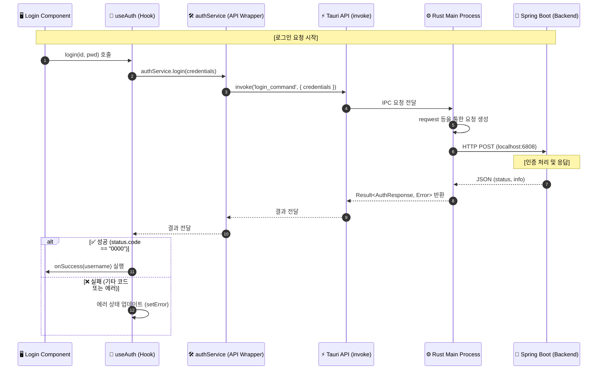

# Tauri POS Project

---

## 🛠 기술 스택 및 라이브러리

- **Language**: [TypeScript](https://www.typescriptlang.org/) (Frontend), [Rust](https://www.rust-lang.org/) (Backend)
- **Frontend Framework**: [React 19](https://react.dev/)
- **Desktop Framework**: [Tauri v2](https://tauri.app/)
- **Build Tool**: [Vite 7](https://vitejs.dev/)
- **Package Manager**: [pnpm](https://pnpm.io/)

---

## 💻 1. 개발 환경 세팅 (Setup)

### 1.1 OS별 필수 도구 설치
#### Windows
1. **Visual Studio Community** 설치 ("C++를 사용한 데스크톱 개발" 워크로드 필수)
2. **Rust 설치**: [rustup.rs](https://rustup.rs/)에서 설치 (MSVC 툴체인 사용)
3. **Node.js & pnpm 설치**

#### macOS
1. **Xcode Command Line Tools**: `xcode-select --install`
2. **Rust 설치**: `curl --proto '=https' --tlsv1.2 -sSf https://sh.rustup.rs | sh`
3. **Node.js & pnpm 설치**

### 1.2 IDE 세팅 (VS Code / Cursor)
**필수 확장:**
- `rust-analyzer`: Rust 자동완성 및 오류 표시
- `Tauri`: 공식 확장 (명령어 실행 및 설정 파일 유효성 검사)

**권장 설정 (`settings.json`):**
```json
{
  "rust-analyzer.checkOnSave.command": "clippy",
  "rust-analyzer.cargo.features": "all"
}
```

### 1.3 의존성 설치 및 실행
```bash
# 의존성 설치
pnpm install

# 개발 모드 실행 (Hot Reload 지원)
pnpm tauri dev
```

---

## 📂 2. 프로젝트 구조 (Structure)

Tauri의 보안 및 성능 모범 사례에 따라 프론트엔드와 네이티브 계층이 분리된 아키텍처를 가집니다.

```text
study_tauri/
├── src/                # 렌더러 프로세스 (React UI 환경)
│   ├── api/            # Renderer 전용 서비스 (Tauri Command 호출 래퍼)
│   ├── components/     # React 컴포넌트 (Login, TicketSales 등)
│   ├── hooks/          # Custom Hooks (비즈니스 로직 분리)
│   ├── types/          # TypeScript 타입 정의
│   ├── App.tsx         # 메인 앱 컴포넌트 및 라우팅
│   └── main.tsx        # React 진입점
├── src-tauri/          # 메인 프로세스 (Rust 네이티브 환경)
│   ├── src/            # Rust 소스 코드
│   │   ├── commands/   # UI에서 호출하는 Rust 함수 (IPC 핸들러)
│   │   ├── services/   # 하드웨어 제어 및 비즈니스 로직
│   │   └── main.rs     # 앱 생명주기 및 핸들러 등록
│   ├── Cargo.toml      # Rust 의존성 관리
│   └── tauri.conf.json # Tauri 설정 파일
├── index.html          # 메인 HTML 템플릿
├── package.json        # Node.js 의존성 및 스크립트
└── tsconfig.json       # TypeScript 설정
```

---

## 🏗️ 3. 전체 아키텍처 및 연동 구조 (Architecture)

현재 프로젝트는 **Tauri(Frontend/Client)**와 **Spring Boot(Backend/Server)**가 연동되는 구조로, 보안과 성능을 고려하여 역할이 분담되어 있습니다.

```mermaid
graph TD
    subgraph "Tauri App (Client)"
        subgraph "WebView Process (UI)"
            UI[React / Vite]
            API_SVC[authService / API Wrapper]
        end

        subgraph "Main Process (Rust)"
            MAIN[Rust Core]
            HTTP[reqwest / HTTP Client]
            PRINTER[프린터 제어 - serialport/usb]
            SERIAL[시리얼 통신 - serialport]
            SQLITE[로컬 DB - rusqlite]
            UPDATER[자동 업데이트 - tauri-plugin-updater]
        end
        
        UI <-->|IPC (Commands/Events)| MAIN
    end

    subgraph "Backend Server"
        SB[Spring Boot]
        DB[(External DB)]
    end

    MAIN <-->|HTTP/HTTPS| SB
    SB <--> DB

    %% 상세 설명 연결
    UI -.->|온라인 API 호출 요청| API_SVC
    API_SVC -.->|Tauri Command 호출| MAIN
    MAIN -.->|오프라인 sync queue| SQLITE
```

### 3.1 계층별 상세 역할

#### 1) WebView Process (UI)
- **Framework**: React / Vite 기반 웹 UI
- **역할**: 사용자 접점(UI/UX), 데이터 입력 및 결과 표시
- **통신**: 보안을 위해 직접적인 외부 API 호출 대신 `invoke()`를 통해 Rust Main Process에 요청을 위임합니다.

#### 2) Main Process (Rust)
- **역할**: 앱의 생명주기 관리 및 하드웨어/시스템 자원 제어 (강력한 보안 및 성능)
- **핵심 기능**:
    - **프린터 제어**: 영수증 출력 등 (`serialport` 등 Rust 크레이트 활용)
    - **시리얼 통신**: POS 주변기기(카드 단말기 등) 연결
    - **로컬 DB**: 오프라인 모드 지원 및 캐싱 (`rusqlite` 등)
    - **오프라인 Sync**: 네트워크 단절 시 데이터를 로컬에 큐잉 후 자동 동기화
    - **자동 업데이트**: Tauri 기본 플러그인을 통한 최신 버전 유지

#### 3) Spring Boot (Backend)
- **역할**: 중앙 집중식 데이터 관리 및 비즈니스 로직 처리
- **핵심 기능**:
    - **메뉴/재고 관리**: 마스터 데이터 관리
    - **매출/현황**: 전체 포스 데이터 집계
    - **멀티 포스 동기화**: 여러 단말기 간 데이터 정합성 유지

---

## 🔄 4. API 통신 프로세스 및 로직 (Process Logic)

보안을 위해 **IPC (Inter-Process Communication)** 방식을 사용합니다. 렌더러는 직접 통신하지 않고 Rust 메인 프로세스를 거쳐 백엔드와 통신합니다.

### 4.1 데이터 흐름도 (Data Flow)



### 4.2 계층별 핵심 역할 (Layer Responsibilities)

| 계층 (Layer) | 파일 위치 | 주요 역할 |
| :--- | :--- | :--- |
| **Component** | `src/components/` | **[사용자 접점]** UI 렌더링, 사용자 입력 수집 |
| **Hook** | `src/hooks/` | **[상태 관리]** UI 상태(로딩, 에러) 제어 및 비즈니스 로직 |
| **Service (Renderer)** | `src/api/` | **[IPC 래퍼]** Tauri `invoke`를 호출하기 쉬운 함수로 래핑 |
| **Main (Rust)** | `src-tauri/src/` | **[네트워크/시스템]** 실제 API 호출 및 시스템 자원 접근 |

---

## 🛠 5. 트러블슈팅 (Troubleshooting)

### 빌드 오류 발생 시 해결 방법

#### 1. Rust 빌드 캐시 삭제 (가장 권장)
`src-tauri` 폴더 안에 있는 `target` 폴더를 삭제해야 합니다. 터미널에서 다음 명령어를 실행하세요:

```bash
# src-tauri 디렉토리로 이동
cd src-tauri
# 빌드 캐시 삭제
cargo clean
# 다시 프로젝트 루트로 이동
cd ..
```
또는 수동으로 `src-tauri\target` 폴더를 삭제하셔도 됩니다.

#### 2. 다시 실행
캐시를 삭제한 후 다시 실행합니다:
```bash
pnpm tauri dev
```

#### 3. 추가 확인 사항
만약 `cargo clean` 후에도 같은 오류가 발생한다면, 다음 파일들에 이전 경로가 하드코딩되어 있는지 확인해 보세요:
- `src-tauri/Cargo.toml`
- `src-tauri/tauri.conf.json`
- `package.json`

---

## 🚀 6. 빌드 및 배포 (Build & Package)

### 6.1 애플리케이션 빌드
설치 프로그램(Installer)을 생성합니다. (결과물: `src-tauri/target/release/bundle/`)
```bash
pnpm tauri build
```

### 6.2 빌드 타겟 옵션
- **Windows 32비트**: `pnpm tauri build -- --target i686-pc-windows-msvc`
- **macOS Universal**: `pnpm tauri build -- --target universal-apple-darwin`

> **참고**: 각 플랫폼 빌드는 해당 OS 환경에서만 가능합니다.
